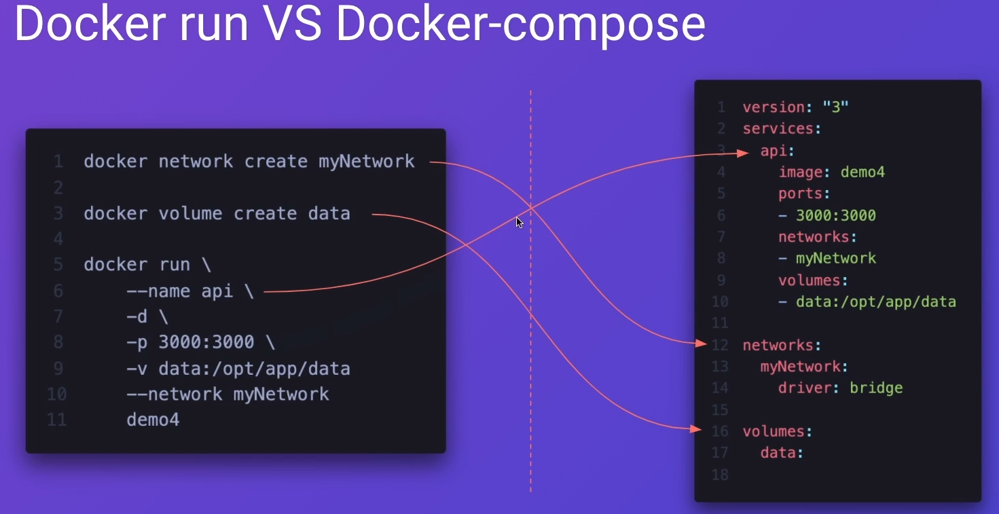

# Docker

## Configure rights
1. Creating groups
```sudo groupadd docker```  
2. Adding users to a group
```sudo usermod -aG docker ${USER}``` or ```sudo usermod -aG docker $(whoami)```  ]

## Location
```sudo ls /var/lib/docker/``` - catalog  
```sudo du -sh /var/lib/docker/overlay2``` – layers size  
```sudo ls /var/lib/docker/overlay2/0267c5ce17995e650659ca27b7344af4edff6a9a705d1a9a7f3547b84012f6f9```  - what's inside, in the layer

## General information
```docker version``` – docker version  
```docker info``` – docker information

## Operational information
```docker stats``` – operational data about working containers  
```docker stats -a``` — operational data about all containers
```docker stats --format "table {{.Name}} \t {{.ID}} \t {{.CPUPerc}} \t {{.MemUsage}}"``` – output only a few fields

## Monitoring
VERSION=v0.47.2 # use the latest release version from https://github.com/google/cadvisor/releases
```sudo docker run \
  --volume=/:/rootfs:ro \
  --volume=/var/run:/var/run:ro \
  --volume=/sys:/sys:ro \
  --volume=/var/lib/docker/:/var/lib/docker:ro \
  --volume=/dev/disk/:/dev/disk:ro \
  --publish=8080:8080 \
  --detach=true \
  --name=cadvisor \
  --privileged \
  --device=/dev/kmsg \
  gcr.io/cadvisor/cadvisor:$VERSION
  ```
``docker logs container_name`` - this command show log in the container  
``docker logs -f container_name`` - this command show log in the container real time


## Troubleshooting and configuration
When you use gitBash on Windows. You should use ```winpty docker run -it ubuntu bash```
or cmd ```docker run -it ubuntu bash```

``.dockerignore`` - this file contains information about data that does not need to be saved in docker image   
``# comment``
``*/temp*`` or ``*/*/temp*`` or ``temp?`` - ignore everything that contains a mask  
``!Readme.md`` - don't ignore everything that contains a mask

## Container

### Starting
```docker run -it -d nginx``` -  running the container in interactive and detach mode 
```docker run -d --name my_nginx nginx``` -  running the container with the name
```docker run -d -p 8080:80 nginx``` — running the container with published ports HOST:CONTAINER  
```docker run -d -v ${PWD}:/usr/share/nginx/html -v ${PWD}/22:/mathefaka:ro -p 8080:80 nginx``` - mapping volumes to the container. ${PWD} - Show the path to work folder. :ro - read only 
```docker run -d -v /home/vladimir/Downloads/Repository/PetProjects/MyDoc/Doker/nginx:/usr/share/nginx/html -p 8081:80 nginx``` - mapping using an absolute path  
```docker run -it -d --name test2 --rm ubuntu bash``` - set name when container is creating and delete container after stop  
older
running container with line split
```
docker run \
--name my-nginx2 \
-v /home/vladimir/Downloads/Repository/PetProjects/MyDoc/Doker/nginx:/usr/share/nginx/html \
-p 8083:80 \
-d \
nginx
```
``docker rename 8742f12f5d95 new_container_name`` - rename container

### Working
### login into the same terminal session
```docker attach NAME``` - login into the same terminal session. Exit ```Ctrl + p after Ctrl + q```  
### Creation of a new terminal session
```docker exec -it b8e45bef8a83 bash``` - running additional process in a running container. You must use ```exit``` to exit the session. Container won't close  
```docker exec -w /tmp container pwd``` - changing the working directory
```docker exec d1f465dc6157 node --version > 1.txt``` - output data
```docker exec -w /tmp d1f465dc6157 sh -c 'node --version > 1.txt'``` - changing the work directory and running the command in this directory  
```docker exec -e Myenv=1 My_mongo printenv``` - adding a new environment to the container
```docker stop 2731223e570f``` - stops the container  
```docker kill 2731223e570f``` - kills a hung process
### Delete containers
```docker container --rm NAME or HASH``` - delete the container after stop  
```docker container prun –f``` - delete all containers after stop without confirmation   

### Monitoring
```docker container ls``` or ```docker ps``` - show only work containers  
```docker container ls –a``` or ```docker ps -a``` – show all created containers  
```docker container inspect 2731223e570f```  or ```dockerclear inspect 2731223e570f```- show container settings  
```docker container inspect 2731223e570f | grep IPAddress```– filtering   
``docker inspect -f '{{ .NetworkSettings.IPAddress }}' 8742f12f5d95`` -  shows the IP address, only for a working container  
``docker inspect -f '{{range.NetworkSettings.Networks}}{{.IPAddress}}{{end}}' 8742f12f5d95``-  shows the IP address, only for a working container  

## Image
```docker history mongo``` – the history of image creation  
```docker inspect mongo``` – information about image  

```docker save имя_образа > transfer.tar``` or ```docker save –output nginx.tar nginx``` - saving the image to the file  
```docker load -i transfer.tar``` or ```docker import nginx.tar svmyhome\nginx1``` - uploading an image to the system  

```docker image pull ubuntu``` – downloading image to the system
```docker image push svmyhome/catnip``` – pushing the image to the repository  
```docker image push my_repo/my_image:my_tag``` – pushing with tag  
```docker tag svmyhomenginx1:latest 11111``` – creating the tag

```docker images``` or ```docker image ls``` – a list of images
```docker images --format "{{.Repository}} {{.Tag}}"``` – a list containing only the necessary columns  
```docker images --format "table {{.Repository}} \t {{.Tag}}"``` – a list in the form of a table

```docker rmi hello-world``` or ```docker image rm python:3-onbuild``` – deleting the image  
```docker image rm -f $(docker images -a -q)``` – deleting all the images  
```docker image prune``` or ```docker rmi -f$(docker images -f "dangling=true" -q)```– deleting the NONE images  
```docker image prune – a``` - deleting all images from non-running containers  
```docker images -f "dangling=true"``` - show unnecessary images  

## Dive
dive id - Utilities for analyzing images and their layers  

## Dockerfile
### build
```docker build -t testapi:latest .``` - creating an image, and when creating an image, all folders and files are saved in the created image
```docker build -f ./apps/api/Dockerfile -t testapi:latest .``` - creating an image when placing a dockerfile in another folder
```docker build --no-cache -t test1:latest .``` - creating an image without caching

### Multistaging build
Multistaging build– позволяет пере использовать то что создано в другом билде и уменьшить объем текущего билда за счет не включения ненужных сборок

FROM node:14-alpine as build
WORKDIR /opt/app
ADD *.json ./
RUN npm install
ADD . .
RUN npm run build api

FROM node:14-alpine
WORKDIR /opt/app
ADD package.json .
RUN npm install --only=prod
COPY --from=build /opt/app/dist/apps/api ./dist

CMD ["node","./dist/main.js"]

## Network
``bridge`` – изолированная сеть между контейнерами (default)
``host`` – та же сеть что и у хоста
``overlay`` -  docker Swarm
``macVlan`` – на контейнер индивидульный мак выделяется
``null`` – без сети
### Commands
``docker network ls`` - shows network interfaces
docker network create my-net1 – создание сети
docker network connect my-net1 node2 – подключение к созданной сети
docker network disconnect my-net1 – отключение от сети
docker network inspect bridge– проверка конкретной сети (показывает в containers  только запущенные контейнеры)
docker network prune -удаление
docker network rm - удалени
docker run --name=node3 --network my-net1 -d demo3:latest
docker run -d --name=node4 -p 3000:3000 --network my-net1 demo3:latest
## MOUNT FILES AND DISKS
### Volumes
### volume in Dockerfile
### BIND папки
```docker run -it --name post3 -v /home/vladimir/docker-demo-4:/postman demo-postman:latest``` - монтирует конкретный каалог хостовой тачки с файлави в папку образа
полный синтаксис:
```docker run -it --mount type=bind,source=/home/vladimir/docker-demo-4,target=/opt/app demo-postman:latest```
```docker run -it --rm --mount type=volume,src=my_python,target=/bind python python /bash/python.py```
## TRPFS
Storing data in memory. Useful only for sensitive data.

## Copying files and folders
### Into the container
```docker cp /home/vladimir/temp2/1.txt b487a6211a48:/tmp``` – copies the file to the docker image  
```docker cp /home/vladimir/temp2/. b487a6211a48:/tmp``` – copies all content of the folders ``tem2`` to the folder ``tmp``  
```docker cp /home/vladimir/test1/ b487a6211a48:/tmp``` – copies the folders ``test1`` with content to the folder ``tmp``

### From the container
```docker cp  b487a6211a48:/tmp/1.txt /home/vladimir/1111``` – copies the file from the docker image
```docker cp  b487a6211a48:/tmp/. /home/vladimir/1111``` – copies all content of the folder from the docker image 
```docker cp  b487a6211a48:/tmp/test1 /home/vladimir/1111```– copies the folder ``test1`` from the docker image

## DOCKER COMPOSE

### Команды
## Recommendation about optimization images
1. Use original images
2. Use images with tags :alpine
3. Combine the ```apt``` command into the single ```RUN``` instruction  ```RUN apt-get update && apt-get install -y \
    package-one \
    package-two```
4. 
